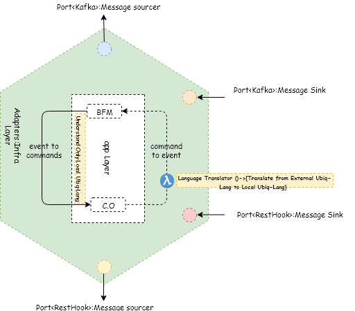
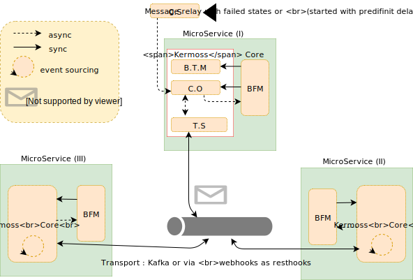

# Kermoss: A Reactive Business Flow

- [Kermoss: A Reactive Business Flow](#kermoss-a-reactive-business-flow)
- [Architecture Overview](#architecture-overview)
  - [Problem:](#problem)
  - [Toolbox:](#toolbox)
    - [Reactive Architecture:](#reactive-architecture)
    - [Hexagonal Architecture:](#hexagonal-architecture)
    - [SAGA pattern / Compensating Transaction pattern:](#saga-pattern--compensating-transaction-pattern)
    - [Let it crash pattern:](#let-it-crash-pattern)
  - [Solution: Kermoss Framework](#solution-kermoss-framework)
    - [Kermoss ToolBox:](#kermoss-toolbox)
  - [Terminologies:](#terminologies)
- [Kermoss Architecture Big Picture :](#kermoss-architecture-big-picture)
- [Role des composants](#role-des-composants)
  - [BusinessTransactionManager :](#businesstransactionmanager)
  - [CommandOrchestrator:](#commandorchestrator)
- [Diagrammes de sequences:](#diagrammes-de-sequences)
  - [LocalTxWorker:](#localtxworker)

# Architecture Overview

## Problem:
  > To improve performance and consistency in a distributed environment, an application shouldn't go for ways such as two-phase commit or you'll find your self in a situation similar to the two generals problem, instead the application should strive for eventual consistency. in such a model a transactional operation is devided into multiple steps. during the execution.

## Toolbox:

### Reactive Architecture:
> Kermoss follows the reactive architecture principles (Available, Resilient, Elastic and Message Driven), All Kermoss instances at runtime contain (Hystrix: *CircuitBreaker*, Ribbon: *Load-Balancer*, Eureka: *Auto-Discovery*)

### Hexagonal Architecture:

### SAGA pattern / Compensating Transaction pattern:
> Kermoss Implements each business transaction(Global Business Transaction) which is split into smaller steps(Local Transaction) as a saga, which is a sequence of local transactions. each local transaction updates the database and publishs a message or an event to trigger the next local transaction. if a local transaction fails it will trigger a business rule called (Rollback policy), the saga will then execute a series of compensating transactions that cancels the changes made by the local transactions

### Let it crash pattern:
> Kermoss was designed to adhere the **Let it crash** pattern, all communications between components, layers follow this pattern, this is where Kermoss gets its reliability characterestic.

-  Pattern rules:
    - Messages are first class citizens was rediscovered by CQRS/ES
    - Each component should tolerate a crash or a restart at anytime
    - All interactions with the other components should tolerate that the peers could crash.
    - Each component should be encapsulated in a way that the crashs wouldn't affect it
    - All requests sent to component should be self describing, in way that would allow the processing to be restarted

## Solution: Kermoss Framework

> Kermoss was designed to serve a network of federated BFM nodes (see federated architecture)  [Terminologies](# terminologies) and inter-connected via distributed command orchestrators (realm-ambassadors), communication between nodes is driven primarily by messages (messages-driven).
The (realm orchestrator) is the initiator of "global business transaction: GTX", an orchestrator of the federated network becomes ambassador after receiving a "Tag" containing GTX and can start by delegation a local transaction ( foreign local transaction: FLTX) in another BFM context, however the (realm orchestrator) is the only one responsible for rollback a (LTX: local transaction / NTLX (nested local transaction) and FLTX: foreign local transaction) via "rollback policies".

### Kermoss ToolBox:

- Saga of transactions distributed via federated orchestrators (realm-ambassador)
- Idempotence out of box at all levels, out of the box
- Reactive BFM by subscribing to the topics of the other BFMs of the same federated network it means Kermoss supports the mode event choreography as well as the mode orchestration of the commands (default mode).
- Very advanced auditabilty: Debugging and monitoring of the entire value chain managed by Kermoss
- Reliability is the core principle of Kermoss and the dimension that gave it more chance to exist

## Terminologies:

- BFM (Business Flow Model): Business Unit Worker; each BUW manages the life cycle of a local transactions
- BTM (Business Transaction Manager): Component managing the life cycle of the global business transaction as well as the local taransactions
- C.O (Command Orchestrator): Manages the life cycle of commands sent by an internal or external BFM
- C.S (Command Scheduler): Manages the life cycle of the commands sent by the BFM
- T.S (Transport Service): Defines routing & mediation rules

# Kermoss Architecture Big Picture :

# Role des composants

## BusinessTransactionManager :
- Component of the application layer
- Manages the life cycle of states in a GlobalTransaction instance by collaborating with the BusinessSateWorker
- Guarantees the idempotance of the states
- Exposes the history of GlobalTransaction instances
- Exposes the history of localTransactions in a single instance of SagaGlobalTransaction.

## CommandOrchestrator:
- Component of the application layer
- Expose command management API from the BusinessTransactionManager or from third-party services.
- Has the Transport Service with adpaters such as REST, Feign, Kafka, ...
- receives a command and persists it with the `STARTED` state by issuing an event ex: `Command <X> Started`
- Can control events (either LocalTransaction `<X> Commited`, or `LocalTransaction <X> Started`, or `TransportCommand <X> Received`, or `TransportCommand <X> Failed`), to mark command with the states (`COMPLETED`, `FAILED`)

# Diagrammes de sequences:

## LocalTxWorker:

